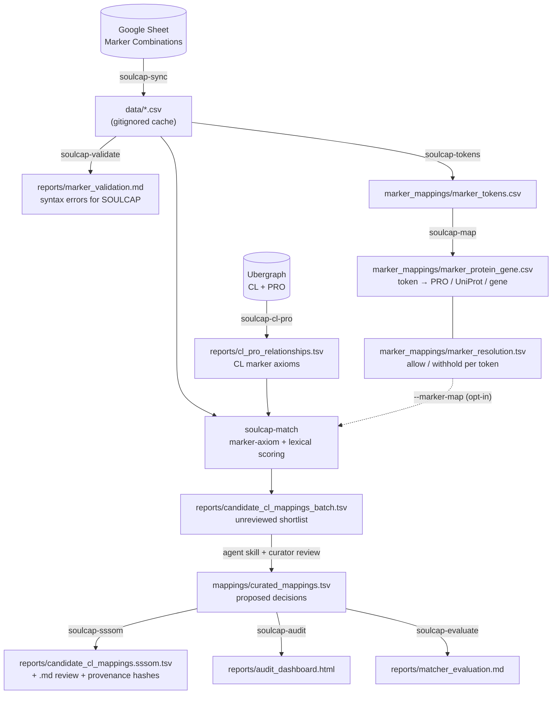

# SOULCAP ↔ Cell Ontology Mapping

> **Warning:** any mappings found in this repo or linked from it are a work in
> progress. They are NOT official products of SOULCAP or the Cell Ontology.

## Aims

Build mappings between [SOULCAP](https://soulcap.org/) and the
[Cell Ontology](https://github.com/obophenotype/cell-ontology) (CL), improving
both resources in the process:

- Give SOULCAP cell types stable, interoperable ontology identifiers.
- Surface gaps and inconsistencies in both resources (missing cell types,
  ambiguous definitions, conflicting marker assertions) so they can be fixed
  upstream.

**SOULCAP** defines immune cell types by positive/negative cell-surface marker
combinations measured by flow cytometry, each backed by reference literature.
**CL** is the community OBO ontology of cell types; many CL terms carry logical
axioms linking them to Protein Ontology (PRO) marker proteins.

**Status (2026-09-28):** 127 SOULCAP cell types have local IDs; 80 have a
proposed CL mapping (50 Exact, 30 Broad). All 80 are `needs_review`. See
[ROADMAP.md](ROADMAP.md) for milestones.

## Pipeline



Stage-by-stage commands and options: [docs/pipeline.md](docs/pipeline.md).

## Key files

| What | Where |
|---|---|
| Source definitions | The [Google Sheet](https://docs.google.com/spreadsheets/d/1uWwczLxgbpWMmXycL8Thq5NVExzlib4A/edit), synced into `data/`. Never edit `data/`; fix the Sheet. |
| Marker expression grammar | [MARKER_SYNTAX.md](MARKER_SYNTAX.md) |
| **Token → PRO mapping** | [marker_mappings/marker_protein_gene.csv](marker_mappings/marker_protein_gene.csv): each marker token with its PRO ID, UniProt ID and gene |
| **Which tokens are withheld, and why** | [marker_mappings/marker_resolution.tsv](marker_mappings/marker_resolution.tsv) (policy per token) and [reports/marker_resolution_audit.md](reports/marker_resolution_audit.md) (effect on matching). How the three relate, and what the SHA-256 column is: [marker_mappings/README.md](marker_mappings/README.md) |
| **Proposed CL mappings (decisions)** | [mappings/curated_mappings.tsv](mappings/curated_mappings.tsv), with local IDs in [mappings/soulcap_entities.tsv](mappings/soulcap_entities.tsv) |
| Proposed CL mappings (to read) | [reports/candidate_cl_mappings.md](reports/candidate_cl_mappings.md) and the SSSOM export [reports/candidate_cl_mappings.sssom.tsv](reports/candidate_cl_mappings.sssom.tsv) |
| CL's own marker axioms | [reports/cl_pro_relationships.md](reports/cl_pro_relationships.md) |
| Gaps in CL or SOULCAP | [reports/gaps.tsv](reports/gaps.tsv), [reports/cl_term_issues.md](reports/cl_term_issues.md) |
| Literature evidence | [literature/](literature/) |
| Audit dashboard | [reports/audit_dashboard.html](reports/audit_dashboard.html) (download and open in a browser) |

## Mapping machinery

The mapping work mixes deterministic code, LLM agent skills and human review.
Each has a clear boundary.

**Deterministic Python** (`src/soulcap_cl_mapping/`, run with `uv run <command>`).
Same inputs, same outputs; covered by unit tests at ≥80%.

| Command | Does |
|---|---|
| `soulcap-sync` | Download the Sheet into `data/` and validate marker strings |
| `soulcap-validate`, `soulcap-tokens` | Check marker strings against the grammar; extract distinct tokens |
| `soulcap-map`, `soulcap-hgnc` | Build the token → PRO / UniProt / gene registry; add HGNC symbols to CL axioms |
| `soulcap-cl-pro` | Pull CL→PRO marker axioms from Ubergraph |
| `soulcap-match` | Rank CL terms against a SOULCAP marker profile (marker axioms, plus lexical with `--lexical`) |
| `soulcap-oak-match`, `soulcap-lookup`, `soulcap-cache-terms` | Name/synonym search in CL (local OAK database, OLS4, or cached labels) |
| `soulcap-sssom` | Turn `curated_mappings.tsv` into SSSOM + a readable review, with per-mapping marker evidence |
| `soulcap-audit`, `soulcap-evaluate`, `soulcap-resolution-audit` | Dashboard, matcher retrieval metrics, effect of marker policies |
| `soulcap-resolved` | List cell types whose markers all resolve to single PRO terms, and the CL terms they reach |
| `soulcap-europepmc`, `soulcap-pubmed`, `soulcap-cache`, `soulcap-validate-report` | Literature search and snippet caching; quote verification |

**Agent skills** (`.claude/skills/`, run by Claude Code). These do judgement
work: choosing between candidates, reading papers, writing rationale. They call
the commands above for anything that can be computed.

| Skill | Purpose | Inputs → outputs | Runs |
|---|---|---|---|
| [soulcap-cl-matching](.claude/skills/soulcap-cl-matching/SKILL.md) | Propose a CL term for a SOULCAP cell type, cross-checking marker and lexical matching, verifying via OLS4 | Sheet rows, CL axioms → proposed mapping with rationale | Agent + `soulcap-match`, `soulcap-lookup` |
| [citation-traversal](.claude/skills/citation-traversal/SKILL.md) | Answer a question from seed papers by following their citations two levels deep | Question + seed DOIs/PMIDs → quoted summary in `reports/citation_traversal/` (gitignored) | Agent + Asta; a hook blocks any quote not verbatim in the cache |
| [pro-marker-species-support](.claude/skills/pro-marker-species-support/SKILL.md) | Check whether a CL PRO marker is supported in human, mouse or both | CL axioms, `literature/` → [reports/pro_marker_species_support.tsv](reports/pro_marker_species_support.tsv) | Agent + `pro_species_support.py`, `soulcap-europepmc` |
| [mapping-audit](.claude/skills/mapping-audit/SKILL.md) | Re-check proposed mappings against current CL axioms and literature; catch drift | SSSOM, CL axioms, `literature/` → `reports/mapping_audit.md` (not yet run) | Agent + `soulcap-match`, `soulcap-lookup` |
| [ontology-term-lookup](.claude/skills/ontology-term-lookup/SKILL.md) | Resolve a biological term to an exact ontology label | Term + ontology → matched ID and label | Agent + OLS4 MCP |
| [gap-issue-filing](.claude/skills/gap-issue-filing/SKILL.md) | File unfiled `gaps.tsv` rows as GitHub issues, avoiding duplicates | `reports/gaps.tsv` → GitHub issues, row updated | Agent + `gh` |
| [roadmap-status-sync](.claude/skills/roadmap-status-sync/SKILL.md) | Correct stale milestone markers in ROADMAP.md from what is on disk | Repo files, issues → ROADMAP.md | Agent |

**Human review.** Every proposal starts as `review_status = needs_review` in
`curated_mappings.tsv`. Per-cell-type evidence and verdicts are written in
[cell_type_reviews/](cell_type_reviews/README.md); only reviews that hit an
uncertainty trigger go to Dr. Diehl. A verdict takes effect only once it is
entered in the Sheet. Gap issues and CL change requests are filed only after
review. (The review folder was scaffolded 2026-09-23 with no reviews yet; how
it relates to [literature/](literature/README.md) is still being confirmed with
Dr. Diehl.)

**Reproducibility.**
- Generated outputs carry SHA-256 hashes of their inputs: the SSSOM export has
  a `.provenance.json` sidecar, and the evaluation JSON records input and
  matcher-source hashes.
- Each marker policy stores a fingerprint of its registry rows, so it fails
  loudly if the registry changes.
- Literature quotes must be verbatim and cited; the citation-traversal hook
  enforces this.
- No numeric confidence is assigned yet, pending calibration against reviewed
  examples.

## Outputs

Every file in [reports/](reports/README.md) is listed in its README with the
command that produces it and whether it is curated or generated. The ones most
people want:

| Output | Producer | Regenerable | For |
|---|---|---|---|
| [candidate_cl_mappings.md](reports/candidate_cl_mappings.md) / [.sssom.tsv](reports/candidate_cl_mappings.sssom.tsv) | `soulcap-sssom` | Yes | Reviewers; CL editors |
| [audit_dashboard.html](reports/audit_dashboard.html) | `soulcap-audit` | Yes (needs `data/`) | Reviewers |
| [gaps.tsv](reports/gaps.tsv), [cl_term_issues.md](reports/cl_term_issues.md) | Hand-curated | No | CL and SOULCAP maintainers |
| [marker_validation.md](reports/marker_validation.md), [marker_string_issues.md](reports/marker_string_issues.md) | `soulcap-sync` / hand-curated | Partly | SOULCAP curators |
| [pro_marker_species_support.tsv](reports/pro_marker_species_support.tsv) | `pro-marker-species-support` skill | No | CL editors |
| [matcher_evaluation.md](reports/matcher_evaluation.md) | `soulcap-evaluate` | Yes | Developers |

## Quick start

Install [UV](https://docs.astral.sh/uv/), then:

```bash
uv sync                  # create the environment
uv run soulcap-sync      # pull the Sheet into data/ (sheet must be link-viewable)
uv run soulcap-match --batch     # candidate shortlist for every cell type
uv run soulcap-sssom     # regenerate the mapping review + SSSOM from curated_mappings.tsv
uv run soulcap-audit     # regenerate the dashboard
uv run pytest            # tests (≥80% coverage enforced)
```

To change a mapping decision, edit
[mappings/curated_mappings.tsv](mappings/curated_mappings.tsv) and re-run
`soulcap-sssom`. MCP servers and API keys (Asta, optional PubMed):
[docs/setup.md](docs/setup.md).

## Repository layout

| Folder | Contents |
|---|---|
| [mappings/](mappings/README.md) | Curated mapping decisions and permanent local entity IDs |
| [marker_mappings/](marker_mappings/README.md) | Token → PRO registry and per-token resolution policy |
| [literature/](literature/README.md) | Literature evidence (verbatim quotes with citations) |
| [cell_type_reviews/](cell_type_reviews/README.md) | One evidence-and-verdict file per SOULCAP cell type |
| [reports/](reports/README.md) | Current outputs, each listed with its producer |
| [docs/](docs/README.md) | Detailed documentation and planning documents |
| [archive/](archive/README.md) | Finished experiments, kept for the record |
| [src/](src/README.md), `tests/` | Python package and its unit tests |

Agent guidance, including where new files go, is in [CLAUDE.md](CLAUDE.md).

## Planning

- Milestones and status: [ROADMAP.md](ROADMAP.md)
- Fall 2026 sprint backlog: [docs/planning/fall_2026_sprint_backlog.md](docs/planning/fall_2026_sprint_backlog.md)
- Sept 21 semester plan draft for Dr. Diehl (proposed, not confirmed):
  [Markdown](docs/planning/fall_2026_semester_plan.md),
  [PDF](docs/planning/fall_2026_semester_plan.pdf),
  [HTML](docs/planning/fall_2026_semester_plan.html)
